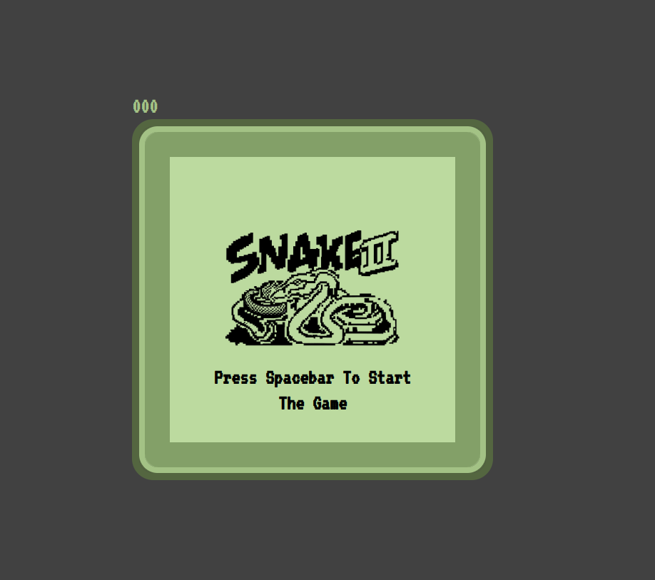

# Snake Xenzia

> JavaScript implementation of a popular snake game known as snake xenzia




## Built With

- HTML
- CSS
- JavaScript


## Live Demo

[Click here for live link >>](https://felix45.github.io/xenzia/)


## Getting Started

To get a local copy up and running follow these simple example steps.

### Prerequisites
```
  node js
  npm install

```
### Setup
Clone the repository and change the directory to xenzia

``` 
  $ git clone git@github.com:Felix45/xenzia.git

  $ cd xenzia

```

### Install
Install all project dependencies by running the command below
 
``` 
  $ npm install
```
### Usage
Open `index.html` using live server

### Deployment
- [Visit Application Homepage](http://localhost:5500)


### Authors

| 👤 Name | Github | Twitter | LinkedIn |
|------|--------|---------|----------|
|Felix Ouma|[@Felix45](https://github.com/Felix45)|[@Felix_Atonoh](https://twitter.com/Felix_Atonoh)|[LinkedIn](https://www.linkedin.com/in/felix-ouma-639766b0/)|


## 🤝 Contributing

Contributions, issues, and feature requests are welcome!

Feel free to check the [issues page](https://github.com/Felix45/xenzia/issues).

## Show your support

Give a ⭐️ if you like this project!

## Acknowledgments

- [Freecodecamp >>](https://www.youtube.com/watch?v=uyhzCBEGaBY&t=898s) for the resources used in this project

## 📝 License

This project is [MIT](https://github.com/git/git-scm.com/blob/main/MIT-LICENSE.txt) licensed.
